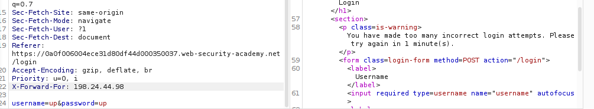
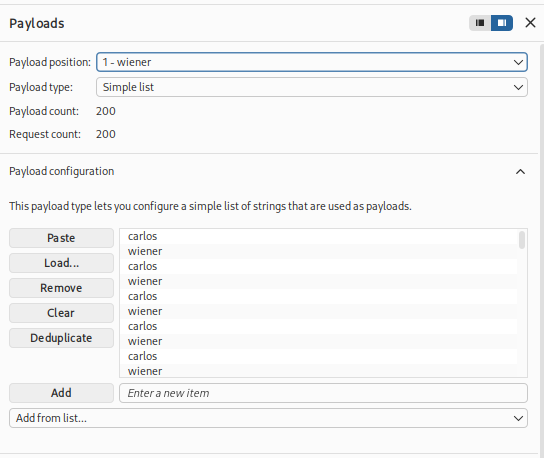
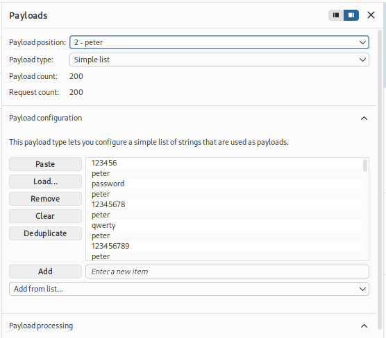
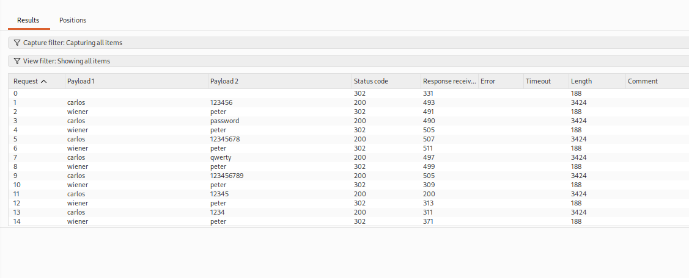
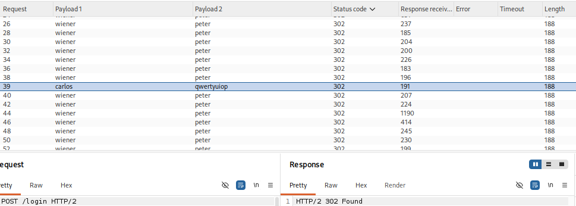
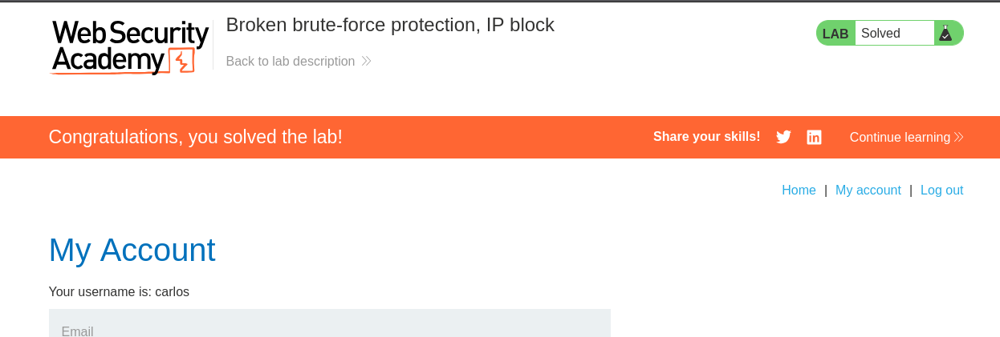

# Broken Brute-Force Protection, IP Block Write-up

This lab demonstrates how to bypass an application's brute-force protection that temporarily blocks an IP address after multiple failed login attempts.

---

## Lab Objective

* Understand the application's brute-force protection.
* Bypass the IP blocking mechanism.
* Perform a password brute-force attack.
* Successfully authenticate as the target user.

---

# Initial Testing

The login page is shown below.

The application temporarily blocks an IP address after **three consecutive failed login attempts**.

My first idea was to bypass the protection by injecting the `X-Forwarded-For` header, as in the previous lab.

However, the application still blocked the requests, indicating that this technique was not effective for this lab.

---

# Analyzing the Protection

After further testing, I observed that the failed login counter is reset whenever a successful login occurs.

This means the application behaves like this:

1. Three failed logins → IP blocked.
2. One successful login → Failed-attempt counter resets.

Using this behavior, it is possible to avoid triggering the IP block by logging into a valid account after each password attempt against the target account.

---

# Preparing the Payloads

To automate this process, I wrote two Python scripts.

## Username Generator

This script alternates between the target username and my own valid account.

* **Python Script:** [alteruser.py](./img&codes/alteruser.py)
* **Generated Usernames:** [usernames.txt](./img&codes/usernames.txt)

## Password Generator

I also generated a password list that matches the alternating username sequence.

* **Python Script:** [alter.py](./img&codes/alter.py)
* **Generated Passwords:** [alteredlist.txt](./img&codes/alteredlist.txt)

---

# Configuring Burp Intruder

The generated username list was added as the first payload.

The generated password list was added as the second payload.

Since both payloads must stay synchronized, I selected the **Pitchfork** attack type.

---

# Resource Pool Configuration

To ensure requests were processed sequentially, I configured a custom **Resource Pool** to send **one request at a time**.

This prevents overlapping requests and ensures the login-reset technique works correctly.

---

# Launching the Attack

After configuring Intruder, I started the attack.

Initially, every request returned an HTTP **200 OK** response.

Eventually, one request returned a different status code:

* **200** → Invalid password
* **302** → Successful authentication

The **302 Redirect** identified the correct password for the target account.

---

# Lab Solved

Using the discovered credentials, I logged into the target account and completed the lab successfully.

---

# Summary

In this lab, I:

* Analyzed the brute-force protection mechanism.
* Determined that a successful login resets the failed-attempt counter.
* Wrote Python scripts to alternate between a valid account and the target account.
* Configured Burp Intruder using the **Pitchfork** attack type.
* Limited requests to one at a time using a **Resource Pool**.
* Identified the correct password by observing an **HTTP 302** response.
* Successfully authenticated and solved the lab.
